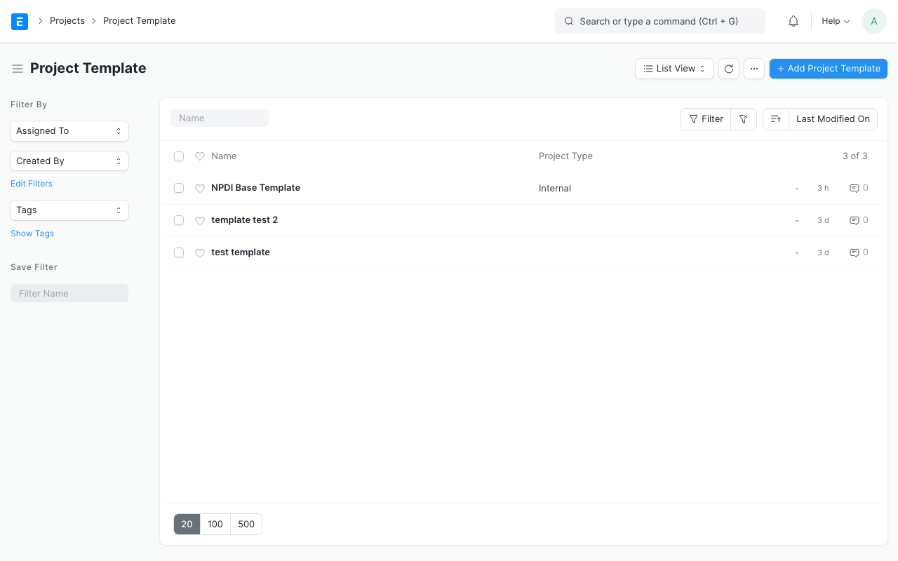
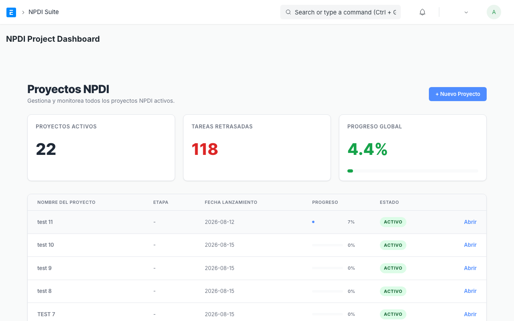

# Manual de Usuario: ERPNext NPDI Suite

Bienvenido al manual de usuario de la **Suite NPDI (New Product Development & Introduction)**. Esta herramienta está diseñada para gestionar, visualizar y optimizar el proceso de desarrollo y lanzamiento de nuevos productos desde su concepción hasta su comercialización.

A continuación, encontrará los pasos necesarios para operar el sistema día a día.

---

## 1. Introducción a la Suite NPDI

El desarrollo de un nuevo producto consta de múltiples fases: Ideación, Formulación, Pruebas Piloto, Aprobaciones de Calidad y Lanzamiento.

La **Suite NPDI** coordina todas estas fases a través de un panel unificado, permitiéndole:
- Visualizar un cronograma de Gantt interactivo.
- Identificar la **Ruta Crítica** (las tareas que, de retrasarse, retrasarían todo el lanzamiento del producto).
- Asignar roles a los miembros del equipo y colaborar mediante comentarios y archivos adjuntos nativos.

---

## 2. Navegación Global (Novedad)

La Suite cuenta con una barra de navegación lateral constante que le permite moverse rápidamente sin necesidad de recargar la página:
- **Dashboard:** Regresa al resumen global y listado de proyectos activos.
- **Plantillas:** Accede directamente al administrador de *Project Templates* para editar o duplicar sus procesos estándar.
- **Configuración:** (Próximamente) Ajustes globales de la suite.

Para acceder, utilice los iconos ubicados en el menú lateral izquierdo oscuro.

---

## 3. Creación de Plantillas de Proyecto (Project Templates)

Para no empezar desde cero cada vez que desarrolla un producto, el sistema utiliza **Plantillas de Proyecto**. Aquí es donde se define el proceso estándar de su empresa.

### ¿Cómo crear una Plantilla?
1. En el buscador de ERPNext, escriba **Project Template** y haga clic en la opción.
2. Haga clic en **Agregar Project Template**.
3. Añada las tareas requeridas para el proceso. 
4. Al editar una tarea (haciendo clic en la flecha de la fila), encontrará campos avanzados de NPDI:
   - **Módulo / Fase:** (Ej. Ideación, Formulación, Pruebas). Esto agrupará la tarea en el gráfico de Gantt.
   - **Rol Responsable (Responsible Role):** En lugar de asignar a un usuario específico (ej. Juan Pérez), asigne un *Rol* (ej. "Líder de Formulación" o "Gerente de Calidad"). Esto facilita la reutilización de la plantilla.
   - **Duración (Horas):** El tiempo estimado de ejecución.
   - **Predecesoras:** Tareas que deben terminar antes de que esta pueda comenzar.

---

## 4. Creación de un Nuevo Proyecto NPDI

Una vez que tenga su plantilla lista, generar un proyecto real es un proceso guiado de pocos pasos.

1. Navegue al **NPDI Project Dashboard**.
2. En la esquina superior derecha, haga clic en el botón **+ Nuevo Proyecto**.
3. Se abrirá una ventana modal:
   - **Nombre del Proyecto:** Ingrese el nombre de su nuevo desarrollo.
   - **Project Template:** Seleccione la plantilla que configuró previamente.
   - **Fecha de Lanzamiento (Target Launch Date):** Seleccione el día en que el producto debe estar listo. *Nota: El sistema calculará automáticamente las fechas de inicio de cada tarea hacia atrás a partir de esta fecha.*
4. **Asignación de Equipo (Role Assignment):** El sistema leerá automáticamente todos los roles definidos en la plantilla seleccionada. 
   - En esta sección, deberá vincular a un usuario real del sistema para cada rol (Ej. Asignar el rol de "Líder de Formulación" al usuario "juan.perez@empresa.com").
5. Haga clic en **Confirmar y crear**.

El sistema procesará la información, generará el cronograma y vinculará a los responsables automáticamente.

---

## 5. Gestión del Proyecto (Dashboard y Tareas)

El **NPDI Project Dashboard** es su centro de comando.

### Gráfico de Gantt Interactivo
- **Ruta Crítica:** Las barras de tarea en color **rojo** indican que están en la ruta crítica. ¡Cuidado con estas tareas! Cualquier retraso en ellas moverá la fecha final del proyecto.
- Las tareas agrupadas por Módulo se pueden expandir o contraer utilizando la flecha izquierda.
- Si arrastra el borde derecho de una tarea, extenderá su duración.

### Panel Rápido de Tareas (Task Detail Drawer)
Haga doble clic sobre el nombre de una tarea en la lista lateral izquierda para abrir el **Panel de Detalles de la Tarea**.

En este panel, usted puede realizar toda la gestión diaria:
1. **Actualizar el Estado:** Cambie el estado de la tarea (Pendiente, En curso, Completada).
2. **Subir Archivos (Adjuntos):** 
   - En la sección **Adjuntos**, haga clic en el botón **+ Subir**. 
   - Seleccione el archivo desde su computadora. Quedará vinculado permanentemente a la tarea de ERPNext.
3. **Colaboración (Comentarios):**
   - En la parte inferior del panel encontrará una caja de texto.
   - Escriba su actualización o consulta y presione el icono de enviar (o Ctrl+Enter). El comentario se guardará en el historial de comunicaciones del sistema.
4. **Guardar Cambios:** Una vez finalizada la edición, haga clic en el botón verde **Guardar** en la parte inferior.

### Botones Contextuales
Al pasar el cursor sobre una tarea en la lista izquierda, aparecerán iconos adicionales:
- 🎯 **Centrar en Gráfica:** Desplaza automáticamente la vista del Gantt hasta el periodo de tiempo donde ocurre la tarea.
- ➕ **Agregar Sub-tarea:** Crea rápidamente una tarea hija.
- 🗑️ **Eliminar:** Elimina la tarea del proyecto.

---

## 6. Control de Desviaciones (Líneas Base)

En el desarrollo de productos es normal que existan retrasos. La Suite NPDI incluye una herramienta para comparar su plan original con la ejecución real.

1. **Capturar Línea Base:**
   - Una vez que su proyecto recién creado esté listo y aprobado, busque el botón **Capturar Línea Base** en el Dashboard.
   - Esto guardará una "fotografía" de las fechas de inicio y fin originales.
2. **Visualizar Desviaciones:**
   - Si una tarea se retrasa, el gráfico de Gantt dibujará una línea semitransparente por debajo de la tarea actual. 
   - Esa línea representa el *plan original*, permitiéndole ver visualmente cuántos días se ha desplazado el trabajo real en comparación con su compromiso inicial.

