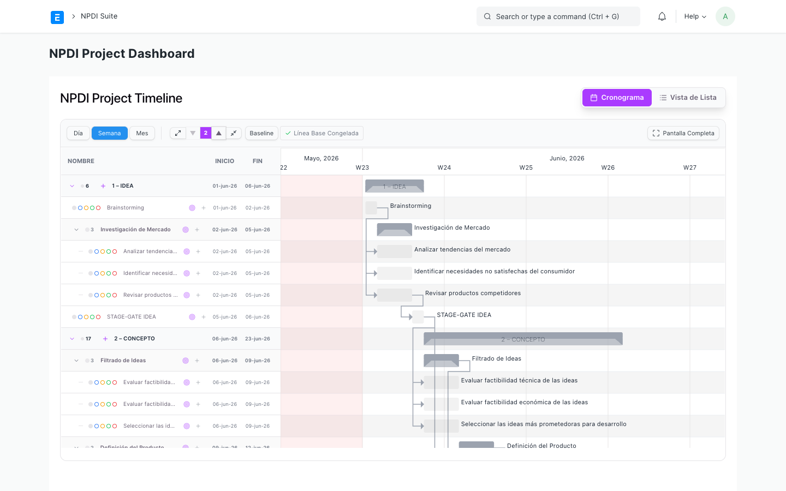

# NPDI Project Dashboard Guide

The **NPDI Project Dashboard** is a unified, isolated workspace page built to manage and visualize product development projects. It provides a multi-view interface showing task hierarchies, critical paths, and execution status.

---

## 1. Accessing the Dashboard

To open the dashboard:
1. Search for **NPDI Project Dashboard** in the awesomebar or select it from the sidebar navigation.
2. Select the target **Project** you wish to view from the filter bar.

---

## 2. Interface Layout & Gantt Chart

Once loaded, the page displays a comprehensive Gantt chart:

### Key UI Sections:
- **Project Filter:** Toggle between active development projects.
- **Groupings by Module:** Tasks are grouped by their NPDI phase/module (e.g. Ideation, Formulation, Trial, Launch) rather than a simple chronological list.
- **Nested Task Nodes:** Expand or collapse sub-task trees to hide clutter.
- **Critical Path Highlight:** Critical tasks are highlighted in red, indicating that any delay will affect the project completion date.

---

## 3. Interactive Task Management

The dashboard is fully interactive. You can modify your schedule directly from this screen:

### Editing Task Schedules:
- **Drag-and-Drop:** Drag task bars in the Gantt chart to shift their start and finish dates.
- **Extend Duration:** Click and drag the edge of a task bar to extend or shorten its duration.

### Contextual Action Buttons:
When you hover over or view a task in the left panel, several action buttons appear next to the task name:
- **Target Icon (🎯):** Centers the Gantt chart view directly onto the task's timeline bar.
- **Plus Icon (➕):** Quickly add a new sub-task under this phase.
- **Trash Icon (🗑️):** Delete the task (if it's not a fixed milestone).

### Task Detail Drawer (Quick Edit Panel):
- **Update Status:** Double-click a task row in the left panel to open the sliding **Task Detail Drawer**.
- **Edit Task Settings:** Here, you can change the status (Pending, In Progress, Completed), view baseline variance, or edit the manual duration.
- **Manage Attachments:** Use the "+ Subir" button in the **Adjuntos** section to natively upload files and link them to the ERPNext Task.
- **Collaborate with Comments:** Use the text box at the bottom of the drawer to write and send comments natively to the Frappe Communications log.

> [!TIP]
> The Task Detail Drawer is fully scrollable, keeping the Save and Cancel buttons easily accessible at the bottom of the screen regardless of how many comments or attachments are loaded.

> [!NOTE]
> Modifying task dates or dependencies on the dashboard automatically triggers the background CPM engine to update predecessor dates and re-evaluate critical paths.
